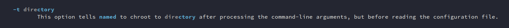

---
title: Understanding Linux Containers
author: Paulo Queiroz
date: 10/2023
...

# Contents

The idea of this tutorial is give a brief explanation of linux containers origins and how they interact with modern systems 

- [A bit of history](#a-bit-of-history)
- [How it works \( the old hard way \)](#how-it-works-the-old-hard-way)
  - [Creating the root directory structure](#creating-the-root-directory-structure)
  - [Creating base device files](#creating-base-device-files)
  - [Needs of a program](#needs-of-a-program)
  - [Beyond binaries](#beyond-binaries)
  - [Last touch \( Dynamic library loader \)](#last-touch-dynamic-library-loader)
  - [Preparing to boot the environment](#preparing-to-boot-the-environment)
  - [Calling chroot](#calling-chroot)
  - [Linux Namespaces](#linux-namespaces)
- [The easy way](#the-easy-way)
  - [Docker](#docker)
  - [Image repositories](#image-repositories)
  - [Convert a server into a container](#convert-a-server-into-a-container)
  - [Networking](#networking)
  - [Boot time](#boot-time)
  - [Connecting to the container](#connecting-to-the-container)
  - [Caveats](#caveats)
- [Conclusion](#conclusion)

\newpage

## A bit of history

Looking back, it can be said that the whole container concept ( arguably ) came from the Unix [chroot](https://en.wikipedia.org/wiki/Chroot) syscall/command.  
Chroot, allows a program to run into a fake root environment ( root file structure ), preventing it from cause havoc in the whole system in case of miss behavior.  
Due its nature, chroot shine when the goal is isolate programs that are easy to compromise or exposed to external malicious actors like hackers.  
When the security on a specific program is breach, only that specific program would be compromised, not the whole server.  
Over the time several programs adopted chroot as part of it's inner capabilities, with most common out of box examples being openssh and isc-bind.  
  
  

In the same way more programs adopted chroot, mostly due security, more features were added to it. Most prominently two new features:  
  
  - Linux kernel namespaces:  
    This allows total isolation of the process inside the chroot environment, where the process becomes pid 1 in it, and loose all default visibility of external memory, sockets and privileged system calls.  

  - Linux kernel cgroups :  
    Kind of quotas, but for cpu cycles, memory, numa, iops ( nics and disks )  
    Which will be discussed in another document as this topic tend to be a bit muddy.

When combined these features serve as foundation to popular projects like Docker, lxc, openvz, podman.  
As a matter of fact some of these features came as improvements and contributions from these projects, enabling the whole ecosystem to grow. 
As time went by, the name container became the most common one, and chroot became the alias, other know alias is "sandboxing".  

Containers ( chroot ) in is full "modern" fashion is not something unique to Linux, is present in other operating systems too, like :
  - Solaris ( it's called zones over there )
  - AIX ( called WPARS )
  - FreeBSD ( called jails )

And the base chroot syscall/command is present in all Unix variants since early 80s

\newpage

## How it works ( the old hard way )

If containers are sort of improved chroot environments, and chroot is in essence "change root", what exactly does that mean ?  
Root in this context means the root filesystem ( / ), and before a processes can be changed to run into it, a few pieces have to be brought together:  

 - A minimal [FHS](https://en.wikipedia.org/wiki/Filesystem_Hierarchy_Standard) root directory structure
 - all libraries and programs needed for the key program to run
 - minimal glibc components to enable core libraries to work
   - that includes some standard files under /etc
 - device files ( /dev stuff ) needed by this root environment to work
 - Unless extreme security is in mind, quality of life programs to make this chroot env. manageable, tools like bash, vim, ls, ps, mpv, lynx, etc.

Stills sounds as vague as before, therefore, lets create one and transplant a few programs to it.  
For the sake of simplicity, lets transplant bash, ps and ls, so the idea can be demonstrated.  
1st fact:  This environment will be hosted at /srv/my_chroot  

### Creating the root directory structure

While the way that files are set inside this structure is very flexible, some directories are nearly mandatory, like:
 - /lib ->  First place where the libc dynamic linker will search for dynamic libraries
 - /dev ->  Base device files, which programs can use to interact with some kernel components ( like stdin/stdout/random )
 - /etc ->  Base global configuration files for the chroot environment ( like id mapping )
 - /proc -> Kernel runtime interface
 - /sys  -> Overall system interface ( can extend to runtime drive parameters, and even BIOS/EFI settings )

These file and directory locations are dictated by Linux FHS standard and current specification can be found at [linux foundation website](https://refspecs.linuxfoundation.org/FHS_3.0/fhs/index.html)  
It's normal to have other directories there too ( most of linux systems do ), the ones above are just the minimal to get the target programs to run.  
A special case not being covered here would be /usr directory, ( and arguably /usr/local ). To simplify this demo, /usr will be a symlink to /.  
Similarly to /usr,  sbin will be a link that will point to bin.  

```sh
(
  mkdir /srv/my_chroot
  cd /srv/my_chroot
  mkdir -p bin lib lib64 dev etc mnt proc root tmp var sys lib/modules share var/empty etc/ssh \
           boot dev/shm dev/pts var/log dev/mapper man
  ln -s . usr
  ln -s bin sbin

)
```

### Creating base device files
Once the base directories are in place, its time for base device files, bash and whatever process inside this root can do io operations.

```sh
mknod -m 0600 /srv/my_chroot/dev/console c 5 1
mknod -m 0600 /srv/my_chroot/dev/tty c 5 0
mknod -m 0666 /srv/my_chroot/dev/null c 1 3
mknod -m 0660 /srv/my_chroot/dev/mapper/control c 10 60
mknod -m 0666 /srv/my_chroot/dev/random c 1 8
mknod -m 0666 /srv/my_chroot/dev/urandom c 1 9
mknod -m 0666 /srv/my_chroot/dev/zero c 1 5
mknod -m 0660 /srv/my_chroot/dev/ttyS0 c 4 64
mknod -m 0660 /srv/my_chroot/dev/loop0 b 7 0
mknod -m 0660 /srv/my_chroot/dev/ram0 b 1 0
mknod -m 0660 /srv/my_chroot/dev/ramdisk b 1 0
```

With that, just /dev/stdin /dev/stdout /dev/stderr are missing and there is a neat way to link them to their /proc counterparts.  

```sh
(
  cd /srv/my_chroot/dev
  ln -s /proc/self/fd/0 stdin
  ln -s /proc/self/fd/1 stdout
  ln -s /proc/self/fd/2 stderr
  ln -s /proc/self/fd .
)
```

\newpage

### Needs of a program

In almost all Unixes, there are two types of programs, the static linked ones and the dynamic linked ones, this is organized in a file format called [ELF](https://en.wikipedia.org/wiki/Executable_and_Linkable_Format).  
A Static linked program, doesn't need to load external libraries ( files ) to work, and a dynamic one needs it.  
The majority or user level programs are dynamically linked, this happens to optimize space consumption and facilitate management, as when an library is updated any program linked to it will receive it.  

To check these things the ldd command can be used as shown bellow.  

A static linked program is:

```sh
# ldd /bin/catatonit
	not a dynamic executable
#
```

A dynamic linked program.

```sh
$ ldd /bin/bash
	linux-vdso.so.1 (0x00007ffff7fc9000)
	libtinfo.so.6 => /lib/x86_64-linux-gnu/libtinfo.so.6 (0x00007ffff7e26000)
	libc.so.6 => /lib/x86_64-linux-gnu/libc.so.6 (0x00007ffff7c45000)
	/lib64/ld-linux-x86-64.so.2 (0x00007ffff7fcb000)
$
```

And as these libraries are elf binaries too, therefore they can have dependencies too:  

```sh
$ ldd /lib/x86_64-linux-gnu/libtinfo.so.6
	linux-vdso.so.1 (0x00007ffff7fc9000)
	libc.so.6 => /lib/x86_64-linux-gnu/libc.so.6 (0x00007ffff7d85000)
	/lib64/ld-linux-x86-64.so.2 (0x00007ffff7fcb000)
$
```

In the search for these libraries and all dependencies, a recursive script will be used to help mapping them all:

```sh
function bin_copy_dependency()
{
  SRC_BIN="${1}"
  DST_DIR="${2}"

  test -n "${SRC_BIN}" -a -n "${DST_DIR}" && {
    test -d "${DST_DIR}" -a -e "${SRC_BIN}" && {
      for F_TO_COPY in $(ldd -d ${SRC_BIN} 2>/dev/null | awk '{ if ( $1 ~ /\// ) printf $1" "; else if ( $3 ~ /\// ) printf $3" "; }' )
      do
        test -e ${F_TO_COPY} && {
          BNAME_F_TO_COPY="$(basename ${F_TO_COPY})"
          BASE_DST="$(dd if=${F_TO_COPY} count=1 bs=512  2>/dev/null | od -x | awk '{ if ( $4 == "0102" ) { print "/lib64"; } else { print "/lib"; } ; exit; }' )"
          mkdir -p ${DST_DIR}/${BASE_DST} 2>&1 > /dev/null
          test -e ${DST_DIR}/${BASE_DST}/${BNAME_F_TO_COPY} || {
            cp -f ${F_TO_COPY} ${DST_DIR}/${BASE_DST}
            bin_copy_dependency ${F_TO_COPY} ${DST_DIR}
          }
        }
      done
    {
  }
  return 0
}
```

\newpage

The script will use the command ldd to scan dependencies for any library we list and recursively.   
So, taking in consideration target programs: bash, ps, ls. This is how the system will look like after executed:  

```sh
# cp -f /bin/bash /bin/ls /bin/ps /srv/my_chroot/bin
# bin_copy_dependency /bin/bash /srv/my_chroot
# bin_copy_dependency /bin/ls /srv/my_chroot
# bin_copy_dependency /bin/ps /srv/my_chroot
# find /srv/my_chroot
/srv/my_chroot
/srv/my_chroot/bin
/srv/my_chroot/bin/bash
/srv/my_chroot/bin/ls
/srv/my_chroot/bin/ps
/srv/my_chroot/lib
/srv/my_chroot/lib/modules
/srv/my_chroot/lib64
/srv/my_chroot/lib64/libtinfo.so.6
/srv/my_chroot/lib64/libc.so.6
/srv/my_chroot/lib64/ld-linux-x86-64.so.2
/srv/my_chroot/lib64/libselinux.so.1
/srv/my_chroot/lib64/libpcre2-8.so.0
/srv/my_chroot/lib64/libproc2.so.0
/srv/my_chroot/lib64/libsystemd.so.0
/srv/my_chroot/lib64/libcap.so.2
/srv/my_chroot/lib64/libgcrypt.so.20
/srv/my_chroot/lib64/libgpg-error.so.0
/srv/my_chroot/lib64/liblzma.so.5
/srv/my_chroot/lib64/libzstd.so.1
/srv/my_chroot/lib64/liblz4.so.1
```

With this, all basic binary requirements should be in place, and now comes the configuration files.  

### Beyond binaries

The bare minimal files needed for this case are :

- LD loader config
- Terminal definitions
- password settings and other base files

Addressing the elephant in the room... "password settings" ?!  
Well all file ownership information is stored in numerical format at the [inodes](https://man7.org/linux/man-pages/man7/inode.7.html), so when a "ls -l" is performed in a file, the numeral data pulled through one of the [stat system calls](https://man7.org/linux/man-pages/man2/stat.2.html) where the numerical information can be converted tothe actual name of the user that owns the file, without these lookup information, all would be shown in numerical format.  

Files that needed to be either generated or copied to the chroot environment:  

```sh
echo -e "/lib\n/lib64\n" > /srv/my_chroot/etc/ld.so.conf
for F in host.conf hosts localtime networks services securetty shells security passwd 
do
  test -f "/etc/${F}" && cp -rp "/etc/${F}" /srv/my_chroot/etc
done
```

For the terminal definitions, well, just the running terminal information will be copied, and this can be determined through the "TERM" variable at the running environment:  

```sh
I_STUFF="$(infocmp ${TERM} -0)" && \
  TFILE="$(echo ${I_STUFF} | grep ^# | cut -d':' -f2 | cut -d' ' -f2)" && \
  mkdir -p /srv/my_chroot/$(dirname ${TFILE}) && \
  cp -rp ${TFILE} /srv/my_chroot/$(dirname ${TFILE})
```

With that, all files we needed to start the environment should be in place.

\newpage

### Last touch ( Dynamic library loader )

The libc program loader ( ld-linux ) works like a interpreter for these elf binaries.  
The Linux kernel will call the loader that will parse the program, and load all its dependencies in order, these dependencies are the dynamic libraries.  
The Loader ( or Dynamic Loader ) uses a configuration file to determine these libraries location and caches most critical library maps in memory.  
This configuration resides in two places, the /etc/ld.so.conf file and environment variables, and for base programs ( like bash ) all data comes from the config and cache.  
To update the cache to reflect the library location for the container, the command ldconfig can be used as shown bellow:  

```sh
# cd /srv/my_chroot
# ldconfig -l -r .
#
```

### Preparing to boot the environment

Now that the environment have been defined, it's matter to emulate the virtual filesystems that the Kernel provides as interface for the applications during boot time:  

```sh
mount none -t sysfs /srv/my_chroot/sys
mount none -t proc /srv/my_chroot/proc
mount none -t devpts /srv/my_chroot/dev/pts
mount none -t tmpfs -o size=512M /srv/my_chroot/run
```


### Calling chroot

Finally, with all defined, starting it is simple, just call "chroot" and point it to the new root, and program to be called ( in this case bash ):

```sh
# chroot /srv/my_chroot /bin/bash

bash-5.2# pwd
/
bash-5.2# ls /etc
host.conf  hosts  ld.so.cache  ld.so.conf  localtime  networks	passwd	services  shells  ssh
bash-5.2# ls -l /etc
total 48
-rw-r--r-- 1 root 0     9 Aug  7  2006 host.conf
-rw-r--r-- 1 root 0   202 Sep  5 06:28 hosts
-rw-r--r-- 1 root 0   734 Oct 31 16:48 ld.so.cache
-rw-r--r-- 1 root 0    13 Oct 31 16:45 ld.so.conf
lrwxrwxrwx 1 root 0    33 Aug 17 02:20 localtime -> /usr/share/zoneinfo/Europe/London
-rw-r--r-- 1 root 0    60 Aug 17 02:20 networks
-rw-r--r-- 1 root 0  2801 Oct 27 18:04 passwd
-rw-r--r-- 1 root 0 12813 Mar 27  2021 services
-rw-r--r-- 1 root 0   128 Oct  8 20:17 shells
drwxr-xr-x 1 root 0     0 Oct 30 17:29 ssh
bash-5.2# cd /root
bash-5.2# ls
bash-5.2# cd /proc
bash-5.2# ls
1	 1006759  1036825  1228744  141      159743   1797     223	2354848  2375886  2393290  2398713  269      3398150  42025   478792  53908   61635  62003   64654  67261  69697   81359      cpuinfo
100	 1006782  1036834  1229109  1414     16       18       225	2355136  2377052  2393390  2398716  27	     3398186  42052   478808  53909   61636  62004   64655  67262  69698   81363      crypto
1005655  1007030  1036
...
```

With this, bash is running under the new root, however  still has direct access to the kernel infrastructure and can try to explore ways around chroot constrains and compromise the whole system.  
The initial premisse of isolate file access have been archived.
To further process isolation, we need to add another capability to this newly born chroot, which is called namespace isolation.

\newpage

### Linux namespaces

Linux kernel namespaces is around since late 2009 and the core idea of it is allow the kernel to partition itself into multiple, semi independent, running instances.  
By partitioning itself, near total isolation can be archived at kernel level, this became pivotal, to what became containers.  
With that a new set of terminologies ( and commands ) started to emerge, such as:

- Container  : A namespace encapsulated process running in a chroot environment ( aka chroot jail, for BSD folks )
- OverlayFS  : This is a wider topic, but at core, it provides the ability to "emulate" read-write operations on top of read-only directories.  
- Host       : The base system running the Container aka chroot
- Kubernetes : Cluster orchestration software to manage Containers and dependencies across these containers.
- Cgroups    : Control groups, sort of quotas for memory/cpu/io/system calls, at namespace level.
- unshare    : A chroot like command that allow namespace manipulation at the chroot moment ( require kernel 4.17+ )
- Images     : Signed tar files, to store the binaries and definitions around the environment

Considering the core idea in scope here , the command that better suite this situation, is unshare, which behaves in a similar way to chroot, except that it also creates the new namespace to place the proccess under it as shown:  

```sh
# unshare --mount-proc -p -R /srv/my_chroot -f /bin/bash
# ps xaf
    PID TTY      STAT   TIME COMMAND
      1 ?        S      0:00 /bin/bash
      2 ?        R+     0:00 ps xaf
# cd /proc
# ls
1	buddyinfo  consoles  diskstats	    execdomains  interrupts  kallsyms	kmsg	     loadavg  misc     net	     schedstat	stat	       sysvipc	    uptime	 zoneinfo
3	bus	   cpuinfo   dma	    fb		 iomem	     kcore	kpagecgroup  locks    modules  pagetypeinfo  self	swaps	       thread-self  version
acpi	cgroups    crypto    driver	    filesystems  ioports     key-users	kpagecount   mdstat   mounts   partitions    slabinfo	sys	       timer_list   vmallocinfo
asound	cmdline    devices   dynamic_debug  fs		 irq	     keys	kpageflags   meminfo  mtrr     pressure      softirqs	sysrq-trigger  tty	    vmstat
# 
```

Through the adoption of unshare, total process isolation can be archived, giving birth to the "modern" concept of containers.  

\newpage

## The easy way

Managing software comes with multiple challenges, from ensuring that all library dependencies are installed, tested releases are always matching properly, keeping everything working together...  
On Linux this is way harder, specially because each distro does things in its own way. Redhat likes /lib64 directories and rpm, Debian likes /lib with a ton of links, Slackware likes SysV, gentoo likes to compile everything....
When combining all these factors, containers became a really neat way to ship software and its updates, all binaries and libraries are executed in these chroot environments, without breaking the host system.  
Companies can use whatever they want, test whatever versions suite them better, and when comes to ship it... Pack everything and ship it, like a real container.
Docker born as tooling to make that possible.  


\newpage

### Docker

Initial versions os docker, were split into a daemon running as root to orchestrate the containers and a client that would communicate with this daemon to control its behaviour.  
In Docker architecture, chroot environments comes from tar files ( called images ), those can be hosted remotely in image hubs, and pulled & unpacked as needed. The most common image hosting service is [hub.docker.com](https://hub.docker.com).  
Software providers and even whole distributions started to publish slimmer versions of its own distros/softwares into these hubs or even release it's own hubs, where a good example is [marketplace.redhat.com](https://marketplace.redhat.com/en-us).  
As time went by, alternatives to docker were built, and for the scope of this document we'll be using [Podman](https://podman.io), which claims to support same command line syntax as docker.  
Underneath the command line, Docker and majority of tools like it works roughly this way:

  1. Unpack the "image" into a directory.
  2. Mount a overlayfs entry using the image directory as basis ( emulate read-write capabilities for the container ).
  3. Create a new cgroup for the environment ( in case resource throttling will be used ).
  4. Create a new namespace and chroot the "init" command inside this new environment.

### Image repositories

With this working model, lets assume we want to pull a redhat enterprise linux environment to run software on top of it.  
This task becomes simple to archive, by looking at the right image repository:  
  
And this image can be up and running by executing a simple combination of commands, like "podman pull" to download the image:  

```sh
# podman pull registry.access.redhat.com/ubi8/ubi:8.8
Trying to pull registry.access.redhat.com/ubi8/ubi:8.8...
Getting image source signatures
Checking if image destination supports signatures
Copying blob 94343313ec15 done
Copying config 2e39d55595 done
Writing manifest to image destination
Storing signatures
2e39d55595ea56337b5b788e96e6afdec3db09d2759d903cbe120468187c4644
#
```

A double check into the image characteristics be be performed using "podman inspect" or if further details are needed, skopeo can be used:  

```sh
# skopeo list-tags docker://registry.access.redhat.com/ubi8/ubi
{
    "Repository": "registry.access.redhat.com/ubi8/ubi",
    "Tags": [
        "8.0-208",
        "8.6-903-source",
        "8.4-199",
        "8.5-214-source",
        "8.1-397-source",
        "8.3-297.1618432833-source",
        "8.5-200-source",
        "8.3-227-source",
        "8.2-347-source",
        "8.5-236.1648460182-source",
        ...
```

\newpage

An added advantage of skopeo over "podman inspect" is that it allows full image tag inspection, of other tags ( releases ) of the same image, as shown:  

```sh
# skopeo inspect docker://registry.access.redhat.com/ubi8/ubi
{
    "Name": "registry.access.redhat.com/ubi8/ubi",
    "Digest": "sha256:c94bc309b197f9fc465052123ead92bf50799ba72055bd040477ded452d87a0d",
    "RepoTags": [
        "8.0-208",
        "8.6-903-source",
        ...
        "8.7-1054.1675788412",
        "8.7-1090.1679482075",
        "8.8-1009",
        "8.8-1009-source",
        "8.8-1032",
        "8.8-1032-source",
        "8.8-1032.1692772289",
        "8.8-1032.1692772289-source",
        "8.8-1067.1697633337-source",
        "8.8-1067.1698056881",
        "latest",
        "8.8",
        "8.8-1067.1698056881-source"
    ],
    "DockerVersion": "",
    "Labels": {
        "architecture": "x86_64",
        "com.redhat.component": "ubi8-container",
        "com.redhat.license_terms": "https://www.redhat.com/en/about/red-hat-end-user-license-agreements#UBI",
        "description": "The Universal Base Image is designed and engineered to be the base layer for all of your containerized applications, middleware and utilities. This base image is freely redistributable, but Red Hat only supports Red Hat technologies through subscriptions for Red Hat products. This image is maintained by Red Hat and updated regularly.",
        "distribution-scope": "public",
        "io.buildah.version": "1.29.0",
        "io.k8s.display-name": "Red Hat Universal Base Image 8",
        "io.openshift.expose-services": "",
        "io.openshift.tags": "base rhel8",
        "maintainer": "Red Hat, Inc.",
        "name": "ubi8",
        "summary": "Provides the latest release of Red Hat Universal Base Image 8.",
        "url": "https://access.redhat.com/containers/#/registry.access.redhat.com/ubi8/images/8.8-1067.1698056881",
        "vcs-ref": "384f2bb33eebab960262e967aa16d01fe2dbebff",
        "vcs-type": "git",
        "vendor": "Red Hat, Inc.",
        "version": "8.8"
    },
    "Architecture": "amd64",
    "Os": "linux",
    "Layers": [
        "sha256:94343313ec1512ab02267e4bc3ce09eecb01fda5bf26c56e2f028ecc72e80b18"
    ],
    "LayersData": [
        {
            "MIMEType": "application/vnd.docker.image.rootfs.diff.tar.gzip",
            "Digest": "sha256:94343313ec1512ab02267e4bc3ce09eecb01fda5bf26c56e2f028ecc72e80b18",
            "Size": 79299514,
            "Annotations": null
        }
    ],
    "Env": [
        "PATH=/usr/local/sbin:/usr/local/bin:/usr/sbin:/usr/bin:/sbin:/bin",
        "container=oci"
    ]
}

```

Among all details available, one interesting is the layer information, which translates to how many overlayfs instances were packed together to form this image, and in this case a single one.  
And finally, to start a container using this image we pulled from redhat, just issue a "podman run" and all instrumentation that was discussed initially will be handled automatically.  

```sh
# podman run -it registry.access.redhat.com/ubi8/ubi:8.8 /bin/bash
[root@1dfece8f67f6 /]# dnf install procps
Updating Subscription Management repositories.
Unable to read consumer identity

This system is not registered with an entitlement server. You can use subscription-manager to register.

Red Hat Universal Base Image 8 (RPMs) - BaseOS                                                                                                                                      1.6 MB/s | 716 kB     00:00
Red Hat Universal Base Image 8 (RPMs) - AppStream                                                                                                                                   5.9 MB/s | 2.9 MB     00:00    A
Red Hat Universal Base Image 8 (RPMs) - CodeReady Builder                                                                                                                           522 kB/s | 100 kB     00:00
Dependencies resolved.
====================================================================================================================================================================================================================
 Package                                          Architecture                                  Version                                              Repository                                                Size
====================================================================================================================================================================================================================
Installing:
 procps-ng                                        x86_64                                        3.3.15-13.el8                                        ubi-8-baseos-rpms                                        330 k

Transaction Summary
====================================================================================================================================================================================================================
Install  1 Package

Total download size: 330 k
Installed size: 881 k
Is this ok [y/N]: y
Is this ok [y/N]: y
Downloading Packages:
procps-ng-3.3.15-13.el8.x86_64.rpm                                                                                                                                                  667 kB/s | 330 kB     00:00
--------------------------------------------------------------------------------------------------------------------------------------------------------------------------------------------------------------------
Total                                                                                                                                                                               663 kB/s | 330 kB     00:00
Running transaction check
Transaction check succeeded.
Running transaction test
Transaction test succeeded.
Running transaction
  Preparing        :                                                                                                                                                                                            1/1
  Installing       : procps-ng-3.3.15-13.el8.x86_64                                                                                                                                                             1/1
  Running scriptlet: procps-ng-3.3.15-13.el8.x86_64                                                                                                                                                             1/1
  Verifying        : procps-ng-3.3.15-13.el8.x86_64                                                                                                                                                             1/1
Installed products updated.

Installed:
  procps-ng-3.3.15-13.el8.x86_64

Complete!
[root@1dfece8f67f6 /]# ps xaf
    PID TTY      STAT   TIME COMMAND
      1 pts/0    Ss     0:00 /bin/bash
     30 pts/0    R+     0:00 ps xaf
[root@1dfece8f67f6 /]# ps -A
    PID TTY          TIME CMD
      1 pts/0    00:00:00 bash
     31 pts/0    00:00:00 ps
[root@1dfece8f67f6 /]#
```

### Convert a server into a container

As these solutions evolved, one topic that started to appear was why not dump whole server into an image ?  
Use all this new tooling to have all cross dependent apps running in the container in a sort of lighter virtualization layer.  
While there are a few constrains in terms of direct access to hardware, there is no real argument preventing that. And as a matter of fact [Solaris zones](https://en.wikipedia.org/wiki/Solaris_Containers) works exactly that way and is well received in the marked.  

To archive something like this, the simplest way possible is by taking a full "tar" of the running server and import it as an image, and this will be explored as this document unfolds.  

#### Analyzing the server

Well for this example, we'll take a running Centos 6 server, running IBM WAS 6.0 :  

```sh
[root@was60 ~]# ps xaf | tail
 1912 ?        Ss     0:00 login -- root
 4821 tty1     Ss+    0:00  \_ -bash
 1916 tty2     Ss+    0:00 /sbin/mingetty /dev/tty2
 1918 tty3     Ss+    0:00 /sbin/mingetty /dev/tty3
 1920 tty4     Ss+    0:00 /sbin/mingetty /dev/tty4
 1922 tty5     Ss+    0:00 /sbin/mingetty /dev/tty5
 1924 tty6     Ss+    0:00 /sbin/mingetty /dev/tty6
 4755 ?        Sl     0:00 /usr/sbin/console-kit-daemon --no-daemon
 4901 ?        Ss     0:00 dhclient
 4929 tty1     Sl     0:25 /opt/IBM/WebSphere/AppServer/java/bin/java -Xbootclasspath/p:/opt/IBM/WebSphere/AppServer/java/jre/lib/ext/ibmorb.jar:/opt/IBM/WebSphere/AppServer/java/jre/lib/ext/ibmext.jar -Dwas.status.socket=41027 -classpath /opt/IBM/WebSphere/AppServer/profiles/default/properties:/opt/IBM/WebSphere/AppServer/properties:/opt/IBM/WebSphere/AppServer/lib/bootstrap.jar:/opt/IBM/WebSphere/AppServer/lib/j2ee.jar:/opt/IBM/WebSphere/AppServer/lib/lmproxy.jar:/opt/IBM/WebSphere/AppServer/lib/urlprotocols.jar -Xms50m -Xmx256m -Dws.ext.dirs=/opt/IBM/WebSphere/AppServer/java/lib:/opt/IBM/WebSphere/AppServer/profiles/default/classes:/opt/IBM/WebSphere/AppServer/classes:/opt/IBM/WebSphere/AppServer/lib:/opt/IBM/WebSphere/AppServer/installedChannels:/opt/IBM/WebSphere/AppServer/lib/ext:/opt/IBM/WebSphere/AppServer/web/help:/opt/IBM/WebSphere/AppServer/deploytool/itp/plugins/com.ibm.etools.ejbdeploy/runtime -Dcom.ibm.itp.location=/opt/IBM/WebSphere/AppServer/bin -Djava.util.logging.configureByServer=true -Dibm.websphere.preload.classes=true -Duser.install.root=/opt/IBM/WebSphere/AppServer/profiles/default -Dwas.install.root=/opt/IBM/WebSphere/AppServer -Djava.util.logging.manager=com.ibm.ws.bootstrap.WsLogManager -Ddb2j.system.home=/opt/IBM/WebSphere/AppServer/cloudscape -Dserver.root=/opt/IBM/WebSphere/AppServer/profiles/default -Djava.awt.headless=true -Djava.security.auth.login.config=/opt/IBM/WebSphere/AppServer/profiles/default/properties/wsjaas.conf -Djava.security.policy=/opt/IBM/WebSphere/AppServer/profiles/default/properties/server.policy com.ibm.ws.bootstrap.WSLauncher com.ibm.ws.runtime.WsServer /opt/IBM/WebSphere/AppServer/profiles/default/config nullNode01Cell node1 server1
[root@was60 ~]#
```

Something like this should be simple, as everything will be copied, 1st step would be capture all filesystems involded:

```sh
[root@was60 ~]# mount | grep ^/
/dev/mapper/vg_was60-lv_root on / type ext4 (rw)
/dev/vda1 on /boot type ext4 (rw)
[root@was60 ~]#
```

The filesystem information is important, mostly because podman and docker has an important constraint: it doesn't support duplicated files within the tar file.  
There is no clear explanation of that, except that when thinking about it. As it helps into saving space, sort of makes sense.  
To ensure that the system is clean, a simple script can be used:  

```sh
# ssh -C root@was60 '( cd / ; tar -cvp --one-file-system  -f /dev/null $(mount | awk "{ if ( \$1 ~ /\/dev/ ) print \$3; }" | xargs) 2>/dev/null )' | sort | uniq -c | grep -v '^ *1 '
root@was60's password:
      2 /boot/
#
```

With this, its possible to identify /boot as the only directory holding duplicated files. As, /boot only hold kernel files it won't be needed in a container environment.  

#### Stop applications 

Tar will create a static image of the server, therefore any file change during this process might corrupt data, with that in mind, next step is stopping the WAS instance.  

```sh
# ssh root@was60
root@was60's password:
[root@was60 ~]# cd /opt/IBM/WebSphere/AppServer/bin/
[root@was60 bin]# ./stopServer.sh server1
JVMJ9VM034E jvmri requires trace engine: run with -Xtrace flag
ADMU0116I: Tool information is being logged in file
           /opt/IBM/WebSphere/AppServer/profiles/default/logs/server1/stopServer.log
ADMU0128I: Starting tool with the default profile
ADMU3100I: Reading configuration for server: server1
ADMU3201I: Server stop request issued. Waiting for stop status.
ADMU4000I: Server server1 stop completed.
[root@was60 bin]#
```

#### Creating the image

To create the image, a tar command will be executed through ssh packing almost all server contents, excluding only a couple of directories.  
The output of the tar command will be fed directly into "podman", which will be called with the "import" parameter to take our tar file as input as show bellow:  

```sh
# ssh -C root@was60 \
  '( cd / ; tar -cp --one-file-system --exclude root --exclude proc --exclude dev --exclude boot --exclude var/spool/postfix --exclude lib/modules -f - $(mount | awk "{ if ( \$1 ~ /\/dev/ ) print \$3; }" | xargs) )' |\
  podman import --message "centos6-was60"   -c "USER root" -c "VOLUME /opt/IBM"   -   was60:latest
root@was60's password:
tar: Removing leading `/' from member names
tar: Removing leading `/' from hard link targets
tar: /var/run/cups/cups.sock: socket ignored
tar: /var/run/portreserve/socket: socket ignored
tar: /var/run/acpid.socket: socket ignored
tar: /var/run/rpcbind.sock: socket ignored
tar: /var/run/abrt/abrt.socket: socket ignored
tar: /var/run/dbus/system_bus_socket: socket ignored
Getting image source signatures
Copying blob fe1a7f1c94ab done
Copying config 57ef87ecda done
Writing manifest to image destination
Storing signatures
sha256:57ef87ecdaca0210a491bb92a26b1642bfced1bf8cb39775f79b63ea74def644
```

A few things must be observed in the executed command:  
1. /opt/IBM is being treated as a volume, so it's expected that the data on top of it changes over time and in a ideal scenario this specific directory would be excluded from the image to not overload the overlayfs with changes
2. Some directories were excluded from the tar along with /boot to save space
3. The last parameter sent to podman is actually the image name, followed by version ( which in this case is latest )

By further inspecting the image those details can be observed:

```sh
# podman inspect was60:latest
[
     {
          "Id": "57ef87ecdaca0210a491bb92a26b1642bfced1bf8cb39775f79b63ea74def644",
          "Digest": "sha256:95ccf356588a01a798c393f85f5cba1143a454a7b4488311cded7dc147a4161a",
          "RepoTags": [
               "localhost/was60:latest"
          ],
          "RepoDigests": [
               "localhost/was60@sha256:95ccf356588a01a798c393f85f5cba1143a454a7b4488311cded7dc147a4161a"
          ],
          "Parent": "",
          "Comment": "centos6-was60",
          "Config": {
               "User": "root",
               "Volumes": {
                    "/opt/IBM": {}
               }
          },
          "Version": "",
          "Author": "",
          "Architecture": "amd64",
          "Os": "linux",
          "Size": 2798091372,
          "VirtualSize": 2798091372,
          "GraphDriver": {
               "Name": "overlay",
               "Data": {
                    "UpperDir": "/var/lib/containers/storage/overlay/fe1a7f1c94ab7db66a83cd5989689ceeaa7d2d4b28425487f016860601604819/diff",
                    "WorkDir": "/var/lib/containers/storage/overlay/fe1a7f1c94ab7db66a83cd5989689ceeaa7d2d4b28425487f016860601604819/work"
               }
          },
          "RootFS": {
               "Type": "layers",
               "Layers": [
                    "sha256:fe1a7f1c94ab7db66a83cd5989689ceeaa7d2d4b28425487f016860601604819"
               ]
          },
          "Labels": null,
          "Annotations": {},
          "ManifestType": "application/vnd.oci.image.manifest.v1+json",
          "User": "root",
          "History": [
               {
                    "created_by": "/bin/sh -c #(nop) ADD file:fe1a7f1c94ab7db66a83cd5989689ceeaa7d2d4b28425487f016860601604819 in /",
                    "comment": "centos6-was60"
               }
          ],
          "NamesHistory": [
               "localhost/was60:latest"
          ]
     }
]
```

With this, all basic server information is properly placed into an image and ready to be started as a container.  \
Out of everything another added benefit is that even an unoptimized container image requires way less disk space than a standalone server or even a virtual machine.

```sh
# podman images
REPOSITORY                     TAG         IMAGE ID      CREATED         SIZE
localhost/was60                latest      57ef87ecdaca  26 minutes ago  2.8 GB
# 
# ssh was60 df -h
root@was60's password:
Filesystem            Size  Used Avail Use% Mounted on
/dev/mapper/vg_was60-lv_root
                       44G  4.1G   38G  10% /
tmpfs                 3.9G     0  3.9G   0% /dev/shm
/dev/vda1             477M   40M  412M   9% /boot
# 
```


#### Networking

Containers are just processes running in isolated name spaces.
By default, podman connect containers to external networks through virtual bridges and ip routing, turning the host server into an ip router.
If the goal is define an static external ip address to the container, then this router must be converted into a switch.  
While the linux bridges itself isn't in scope of this tutorial ( maybe another time... maybe talk about ovs too ), to attach a bridge to the container, is just a matter of run:  

```sh
# podman network create -d bridge --interface-name br0 --subnet 172.16.0.0/24 --ip-range 172.16.0.0/24 --gateway 172.16.0.1 my_br0
my_br0
#
```

By running this, podman will create a "virtual" network definition with the following characteristics:  
  - Name: my_br0
  - Type: bridge ( standard ethernet bridge )
  - Parent interface: br0, it's the linux bridge interface that holds the connections to the physical network interfaces
  - subnet, ip-range, gateway: IP configuration for the container and 172.16.0.1 should be an external router.


The network characteristics can be inspected in through podman too:  

```sh
# podman network inspect my_br0
[
     {
          "name": "my_br0",
          "id": "139cbbf9235ff11d1cbcc4f2518f27b75caafc8506fec234998992202751f423",
          "driver": "bridge",
          "network_interface": "br0",
          "subnets": [
               {
                    "subnet": "172.16.0.0/24",
                    "gateway": "172.16.0.1",
                    "lease_range": {
                         "start_ip": "172.16.0.1",
                         "end_ip": "172.16.0.255"
                    }
               }
          ],
          "ipv6_enabled": false,
          "internal": false,
          "dns_enabled": true,
          "ipam_options": {
               "driver": "host-local"
          }
     }
]
#
```

#### Boot time

To sort of boot up this container environment, a init process should be emulated.  
While optimized distributions have specific processes around that, here a standard /bin/bash attached to a virtual terminal will do.  
The biggest drawback of this approach is that all process that normally would be started in the background at the former server, won't be started automatically and should be scripted instead.  
To start the container, "podman run" can be called:  

```sh
 podman run -d --ulimit memlock=-1  --shm-size=1g --rm -ti --name was60 --ip 172.16.0.2 --network=my_br0  -P --privileged -l was60  -h was60 localhost/was60:latest /bin/bash
```

This will start the container in the background, as a daemon, with the following characteristics:  
  - a SHM size of 1Gb ( java likes memory )
  - container hostname set to was60 ( so application config doesn't notice the change )
  - attach to the previously defined bridge ( my_br0 )
  - statically add the ip
  - /bin/bash will be used as "init" and the container will run in detached mode ( like a daemon )

The biggest caveat of this approach is how the whole init process is being handled, in a longer term scenario would be advisable to trap this behind a script to avoid unwanted terminations.  

#### Connecting to the container

Connect to the container runtime environment is simple as placing a new shell instance into the container, and is how the WAS process will be started for this demo.  

```sh
# podman exec -it MY_WAS60 /bin/bash
bash-4.1#
bash-4.1# ps xaf
    PID TTY      STAT   TIME COMMAND
      2 pts/1    Ss     0:00 /bin/bash
      3 pts/1    R+     0:00  \_ ps xaf
      1 pts/0    Ss+    0:00 /bin/bash
bash-4.1#
bash-4.1# /opt/IBM/WebSphere/AppServer/bin/startServer.sh server1
JVMJ9VM034E jvmri requires trace engine: run with -Xtrace flag
ADMU0116I: Tool information is being logged in file
           /opt/IBM/WebSphere/AppServer/profiles/default/logs/server1/startServer.log
ADMU0128I: Starting tool with the default profile
ADMU3100I: Reading configuration for server: server1
ADMU3200I: Server launched. Waiting for initialization status.

ADMU3000I: Server server1 open for e-business; process id is 99
bash-4.1#
bash-4.1# ip addr
1: lo: <LOOPBACK,UP,LOWER_UP> mtu 65536 qdisc noqueue state UNKNOWN qlen 1000
    link/loopback 00:00:00:00:00:00 brd 00:00:00:00:00:00
    inet 127.0.0.1/8 scope host lo
       valid_lft forever preferred_lft forever
    inet6 ::1/128 scope host
       valid_lft forever preferred_lft forever
2: eth0@if18: <BROADCAST,MULTICAST,UP,LOWER_UP,M-DOWN> mtu 1500 qdisc noqueue state UP qlen 1000
    link/ether b2:e9:6a:34:17:cc brd ff:ff:ff:ff:ff:ff
    inet 172.16.0.2/24 brd 172.16.0.255 scope global eth0
       valid_lft forever preferred_lft forever
    inet6 fe80::b0e9:6aff:fe34:17cc/64 scope link
       valid_lft forever preferred_lft forever
bash-4.1# ip route
default via 172.16.0.1 dev eth0  proto static  metric 100
172.16.0.0/24 dev eth0  proto kernel  scope link  src 172.16.0.2
bash-4.1#
bash-4.1# uname -a
Linux was60 6.5.0-0.deb12.1-amd64 #1 SMP PREEMPT_DYNAMIC Debian 6.5.3-1~bpo12+1 (2023-10-08) x86_64 x86_64 x86_64 GNU/Linux
bash-4.1# cat /etc/centos-release
CentOS release 6.10 (Final)
bash-4.1#
```

At end it easy to demonstrate that this CentOS container is not only running on top of Debian 12, but also have its own dedicated IP address.


### Caveats

While the biggest caveats around containerization strategies are similar to the ones encountered in software virtualization; the most preeminent one is filesystem management.
By default, all containers will share /var filesystem, which might result into performance penalties that's why its recommended to split container data into volumes and performance specific ones to be mapped to dedicated filesystems or even disks.  

#### Binary support

While Linux kernel retain compatibility from it's earlier releases ( 2.0* ) some system calls might be have been refactored over time, due either performance or security reasons.  
This example indirectly covers it by using centos6, which relied in the old vsyscall interface that was replaced by vDSO ( post 2012 ).  
To make this example possible, the "vsyscall=emulate" had to be sent to the kernel.  

#### Startup sequences

Differently from a server, containers are just environments to run applications, any cross dependency between applications must be dealt manually, in a similar way that sysvinit or even a clustering software would handle it.  
With this characteristic in mind, container orchestration softwares like kubernetes or swarm are widely adopted.  
Kubernetes is almost a industry standard at this point and the current "goto" solution in case this is needed.  


#### Vendor Support

Well, while technically, this containerization approach doesn't change the binaries of the server, it's unlike that any vendor offers full commercial support for such approach.  
This lack of full commercial support, happens mostly because software providers already ship their own supported and tested containers, therefore there is no reason to support anything else.  
Besides, if you're going through this hassle, it might be worth changing to a supported and 3rd party maintained base image.  
In case of IBM DB2, for example, you can have free public versions for testing and paid kubernetes designed offerings.  
Going the simple cheap version here:  

```sh
# skopeo inspect docker://icr.io/db2_community/db2
{
    "Name": "icr.io/db2_community/db2",
    "Digest": "sha256:9002c04b6c0f11e72531b6bb72f33119aaf25f965afb29d8951cfb4a2f5d715c",
    "RepoTags": [
        "11.5.5.1",
        "11.5.7.0a",
        "11.5.8.0",
        "latest"
    ],
    "Created": "2023-05-25T17:31:44.793287926Z",
    "DockerVersion": "20.10.7",
    "Labels": {
        "architecture": "x86_64",
...
```

## Conclusion

In the end, "container" the natural evolution of chroot, and in terms of software distribution for linux, seems to be the future.  
In the server space tools like podman, docker, crio, conmon enables this enables this vision for development and distribution. And when combined with automation tools like kubernetes, mesos, swarm, a fully containerized environment is possible.  
Switching to the desktop space, this vision takes the form of flatpaks and snaps. But that's a different story.
